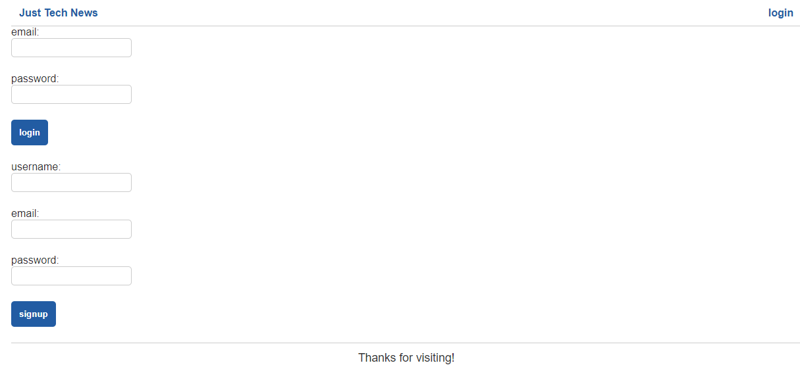

  # Just Tech News
  This SQLAlchemy and Flask Python application is a refactor of an existing full-stack JavaScript web application. Just like the original, this application allows users to make, comment upon, and vote on community-generated posts. This application uses a model-view-controller framework to handle data. Users are able to create and login to personal accounts, create, edit, and delete posts + upvote and comment on posts. The application on the front end uses Jinja for its templating engine. On the backend, Flask replaces Node.js and Express.js, and SQLAlchemy replaces Sequelize.
  
  ## Table of Contents
  * [Installation](#installation)
  * [Built With](#built)
  * [Usage Information](#usage)
  * [Authors & Acknowledgements](#credits)
  * [Contact](#questions) 
  
  ## Installation
  This application has been deployed to Heroku and can be accessed via its link. For local use, please create a .env file with your MySQL credentials DB_URL=mysql+pymysql://root:<your-password>@localhost/python_news_db
  
  ## Built With
  * Python
  * Flask
  * Jinja
  * SQLAlchemy
  * MySQL
  * bcrypt
  * gunicorn
  * PyMySQL
  * python-dotenv

  ## Usage Information
  [Just Tech News](https://python-just-tech-news-85793e50049a.herokuapp.com/) 
    
  This application hosts a forum for community-generated posts. 
    
    
  ## Authors & Acknowledgements
  
  Base code © 2020 - 2022 Trilogy Education Services, a 2U, Inc. brand. All Rights Reserved.  
  
  Made by [TOVTC](https://github.com/TOVTC).

  ## Questions?
  Contact repository author via [GitHub](https://github.com/TOVTC). 